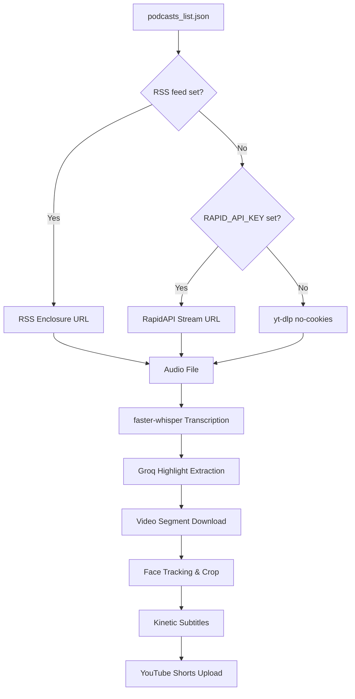

# 🎙️ Podcast Shorts Automation Pipeline

An autonomous, production-grade system that sources, processes, and uploads high-engagement YouTube Shorts from popular podcasts — **no YouTube cookies required**.

## 🚀 Key Features
- **Smart Sourcing**: Weighted 75/25 selection from curated Indian and Global podcasts.
- **RSS-First Audio Acquisition**: Downloads episode audio directly from podcast RSS feed enclosures (MP3/M4A) — bypasses YouTube entirely for podcasts that expose a feed URL.
- **RapidAPI Fallback**: When no RSS feed is configured, uses RapidAPI to resolve a downloadable YouTube audio/video stream without any session cookies.
- **AI-Powered Highlight Extraction**:
  - Word-level transcription via `faster-whisper`.
  - Engagement analysis using `Groq (Llama-3-70b)`.
- **Dynamic Video Engine**:
  - **Auto-Face Tracking**: Intelligently crops 16:9 videos to 9:16 vertical shorts.
  - **Kinetic Subtitles**: High-impact, synced captions with keyword highlighting.
  - **Progress Visualizer**: Sleek progress bar to boost viewer retention.

---

## 🛠️ Project Architecture


---

## ⚙️ Setup & Installation

### 1. Requirements
- Python 3.11+
- `ffmpeg` installed on your system.

### 2. Required GitHub Actions Secrets

| Secret | Required | Purpose |
|--------|----------|---------|
| `YOUTUBE_CLIENT_ID` | ✅ Yes | OAuth client ID for YouTube upload |
| `YOUTUBE_CLIENT_SECRET` | ✅ Yes | OAuth client secret for YouTube upload |
| `YOUTUBE_REFRESH_TOKEN` | ✅ Yes | OAuth refresh token for YouTube upload |
| `YOUTUBE_API_KEY` | Recommended | YouTube Data API key for episode discovery |
| `RAPID_API_KEY` | Recommended | RapidAPI key for YouTube audio/video download (fallback when no RSS) |
| `GROQ_API_KEY` | ✅ Yes | Groq API key for AI highlight extraction |
| `DISCORD_WEBHOOK_URL` | Optional | Discord notification on successful upload |

> **Note:** `YOUTUBE_COOKIES` is no longer used and can be removed from your secrets.

#### How to obtain `YOUTUBE_REFRESH_TOKEN`
Run `python refresh_token.py` locally and follow the OAuth flow. Copy the printed refresh token into the GitHub secret.

#### How to obtain `RAPID_API_KEY`
1. Sign up / log in at [rapidapi.com](https://rapidapi.com).
2. Subscribe to the **"YouTube Download Video and Audio v2"** API.
3. Copy your **X-RapidAPI-Key** from `https://rapidapi.com/developer/apps`.
4. Add it as a GitHub Actions secret named `RAPID_API_KEY`.

### 3. Podcast RSS Feed Support

Each entry in `podcasts_list.json` accepts an optional `rss_feed` field:

```json
{
  "name": "Huberman Lab",
  "channel_id": "UC2D2CMWXMOVWx7giW1n3LIg",
  "url": "https://www.youtube.com/@hubermanlab",
  "theme": "science, health, neuroscience",
  "rss_feed": "https://feeds.megaphone.fm/hubermanlab"
}
```

**When `rss_feed` is set:**
- The pipeline downloads the audio directly from the RSS enclosure URL (typically an MP3 or M4A hosted on the podcast's CDN).
- No YouTube API quota is consumed for the audio download.
- The episode is selected by checking iTunes duration metadata; episodes shorter than `MIN_EPISODE_DURATION` (default 10 min) are skipped.

**When `rss_feed` is not set (default):**
- The pipeline falls back to RapidAPI (if `RAPID_API_KEY` is configured), then yt-dlp.
- If yt-dlp encounters a "Sign in to confirm you're not a bot" error, the job **fails immediately** with an actionable message rather than silently swallowing the error.

---

## 📅 Automation Schedule
The pipeline runs daily via **GitHub Actions** at **5:00 PM IST (11:30 UTC)**.
Manual triggers are available in the **Actions** tab.

---

## 📄 License
This project is for educational and personal use. Ensure you have the rights or follow fair-use guidelines for the podcasts you clip.
