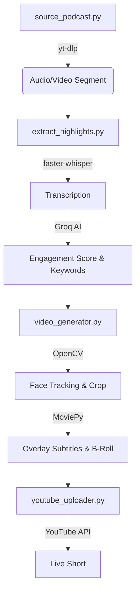

# 🎙️ Podcast Shorts Automation Pipeline

An autonomous, production-grade system that sources, processes, and uploads high-engagement YouTube Shorts from popular podcasts.

## 🚀 Key Features
- **Smart Sourcing**: Weighted 75/25 selection from curated Indian and Global podcasts.
- **AI-Powered Highlight Extraction**: 
  - Word-level transcription via `faster-whisper`.
  - Engagement analysis using `Groq (Llama-3-70b)`.
- **Dynamic Video Engine**:
  - **Auto-Face Tracking**: Intelligently crops 16:9 videos to 9:16 vertical shorts by following the speaker.
  - **Kinetic Subtitles**: High-impact, synced captions with keyword highlighting and animations.
  - **Progress Visualizer**: Sleek progress bar to boost viewer retention.
- **Premium V2 Enhancements**:
  - **Satisfying Split-Screen**: Sunday automation with GTA/Satisfying video backgrounds.
  - **Auto-B-Roll Flash**: Intentional stock image flashes to hook viewers in the first seconds.
  - **AI Smart SEO**: Auto-generated viral titles and hashtags.
- **Bot-Detection Bypass**: Multi-tier bypass suite (Headers, Mobile Client spoofing, and Cookies support) for reliable GitHub Actions execution.

---

## 🛠️ Project Architecture

---

## ⚙️ Setup & Installation

### 1. Requirements
- Python 3.11+
- `ffmpeg` installed on your system.
- NVIDIA GPU (Optional - for faster faster-whisper/rendering).

### 2. Environment Secrets
Create a `.env` file or set GitHub Secrets for:
- `GROQ_API_KEY`: For highlight extraction and SEO.
- `YOUTUBE_CLIENT_ID`: Google Cloud API Client.
- `YOUTUBE_CLIENT_SECRET`: Google Cloud API Secret.
- `YOUTUBE_REFRESH_TOKEN`: OAuth Refresh token for uploads.

### 3. Bot-Detection Bypass (Required for GitHub Actions)
To prevent YouTube from blocking the automated runner:
1. Export your YouTube session cookies using the **"Get cookies.txt LOCALLY"** browser extension.
2. Rename the file to `cookies.txt`.
3. Add it to the project root.

---

## 📅 Automation Schedule
The pipeline is pre-configured to run daily via **GitHub Actions** at:
- **5:00 PM IST (11:30 UTC)**

Manual triggers are available in the **Actions** tab of the repository.

---

## 📄 License
This project is for educational and personal use. Ensure you have the rights or follow fair-use guidelines for the podcasts you clip.
